<!-- HEADER ANIMATED MATRIX FALLING CODE BANNER -->

  

<!-- ANIMATED TYPING SUBTITLE (EMERALD GREEN AESTHETIC) -->

  

 

<!-- QUICK STATS & LIVE COUNTERS (DARK & GREEN ACCENT) -->

  
  
  

<!-- SOCIAL BADGES -->

  
  
  
  

 

<!-- ABOUT ME -->
<table>
  <tr>
    <td width="55%" valign="top">
      <h3>About Me</h3>
      

        Hi there! I'm <b>Divy Viradiya</b>, a Software Developer focused on building high-speed desktop utilities, cross-platform applications, systems programming, and modern full-stack architectures.
      

      <ul>
        <li><b>Creator of EtherTransfer</b>: High-speed PC-to-PC file transfer over LAN/Ethernet cable.</li>
        <li><b>Core Contributor to PocketMC</b>: Desktop management application for Minecraft instances and server operations.</li>
        <li><b>Creator of Photo-Fix</b>: Blazing-fast batch image processing and enhancement engine built in Rust.</li>
        <li><b>Ask me about</b>: C#, Rust, TypeScript, Cross-platform GUI development, and Networking.</li>
      </ul>
    </td>
    <td width="45%" align="center" valign="middle">
      
    </td>
  </tr>
</table>

---

<!-- SKILLS / TECH STACK ICONS -->
<h3 align="center">Tech Stack & Skills</h3>

  <a href="https://skillicons.dev">
    
      
    
      
    
      
    
  </a>

 

---

<!-- MAIN PROJECTS (EXCLUSIVELY THE 3 PRIMARY REPOSITORIES) -->
<h3 align="center">Main Projects</h3>

  <!-- Row 1: Primary Flagship Systems -->
  
  &nbsp;
  
    
  <!-- Row 2: Rust Engine -->
  

 

---

<!-- SEAMLESS ANIMATED ANALYTICS DASHBOARD (DARK & GREEN ACCENT) -->
<h3 align="center">Activity & Analytics Dashboard</h3>

  <!-- Top Animated Summary Banner Card in Dark & Green -->
  
    
  <!-- Bottom Animated Row -->
  
  &nbsp;
  

 

---

<!-- FOOTER ANIMATED EMERALD GRADIENT BANNER -->

  

