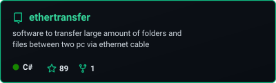
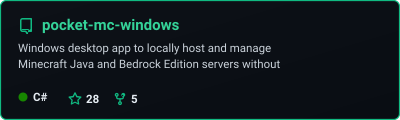
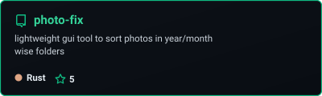
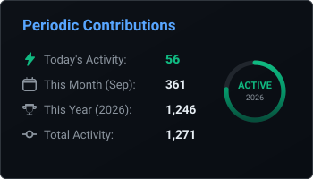
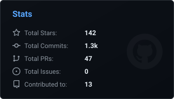
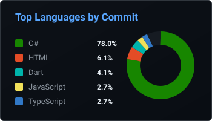

<!-- HEADER ANIMATED MATRIX FALLING CODE BANNER -->

  

<!-- ANIMATED TYPING SUBTITLE (EMERALD GREEN AESTHETIC) -->

  

 

<!-- ORGANIZATIONS & SOCIAL BADGES -->

  
  
  
  
  

 

<!-- ABOUT ME -->
<h2 align="center">About Me</h2>

  Founder and systems developer crafting high-speed native desktop software, network tooling, and open-source infrastructure.

 

I am a second-year Computer Engineering undergraduate at **LD College of Engineering, Ahmedabad**, living in **Surat, Gujarat**.

Most of my time is spent engineering fast, lightweight software where speed, low memory footprints, and practical utility come first. I love working close to the machine—building native desktop clients, exploring custom networking protocols, and designing robust systems in **C# / .NET** and **Rust**.

 

### Organizations & Ventures

- **[PocketMC](https://pocketmc.github.io/pocket-mc-website/)** — Founder
  A modern desktop application built to make deploying, configuring, and managing local Minecraft servers intuitive and effortless without terminal mess.

- **[DS Labs](https://ds-labs.vercel.app)** — Founder
  An independent initiative dedicated to exploring custom software systems, developer utilities, and high-performance experiments.

---

<!-- SKILLS / TECH STACK ICONS -->
<h3 align="center">Tech Stack & Skills</h3>

  <a href="https://skillicons.dev">
    
      
    
      
    
      
    
  </a>

 

---

<!-- MAIN PROJECTS (SELF-HOSTED VIA GITHUB ACTIONS) -->
<h3 align="center">Main Projects</h3>

  

    
    &nbsp;&nbsp;
    
  

  

    
  

 

---

<!-- SEAMLESS ANIMATED ANALYTICS DASHBOARD (SELF-HOSTED VIA GITHUB ACTIONS) -->
<h3 align="center">Activity & Analytics Dashboard</h3>

  <!-- Row 1: Periodic Contributions (Today, Month, Year) & Overall Stats -->
  

    
    &nbsp;&nbsp;
    
  

  
  <!-- Row 2: Language Breakdown Donut -->
  

    
  

 

---

<!-- FOOTER ANIMATED EMERALD GRADIENT BANNER -->

  

